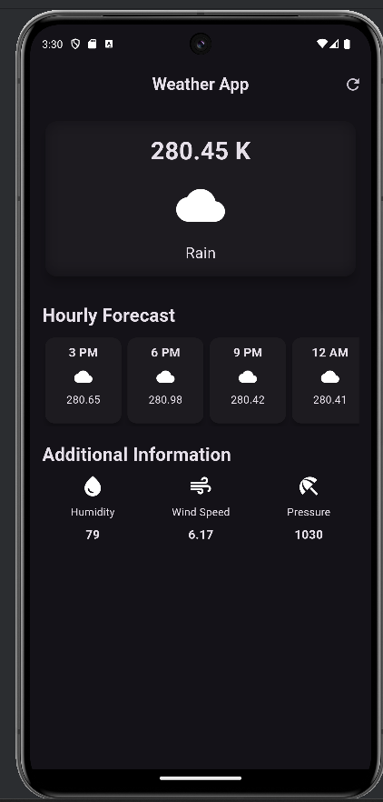
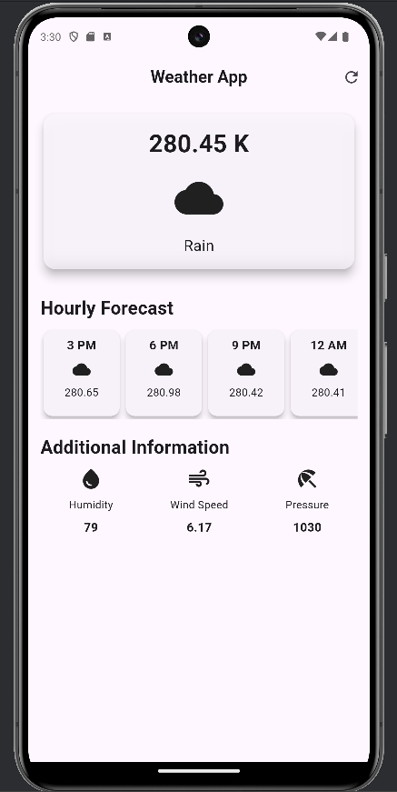

# Weather App 🌤️

A weather application built using **Flutter**, fetching real-time weather data from the OpenWeather API. The app is designed to display current weather conditions, hourly forecasts, and additional weather-related information in a clean and user-friendly interface.

---

## Features ✨

- **Current Weather**:  
  Displays the current temperature, weather conditions (e.g., sunny, cloudy), and an icon representing the sky condition.

- **Hourly Forecast**:  
  View a 6-hour weather forecast, including temperature and sky conditions.

- **Additional Information**:  
  Get detailed data on:
  - Humidity
  - Wind Speed
  - Atmospheric Pressure

- **Refresh Button**:  
  Quickly refresh weather data to get the latest updates.

- **Sleek UI**:  
  The app features a Material 3 design with a dark theme for an aesthetic and modern user experience.

---

## Screenshots 📸

---

## API Used 🌐

The app integrates with the **OpenWeather API** to fetch real-time weather data.  
Check out their documentation [here](https://openweathermap.org/api).

---

## Dependencies 🧩

- **Flutter**: Cross-platform app development framework.
- **HTTP**: Handles API requests.
- **intl**: Used for date and time formatting.

---

## Credits 🙌

This app was developed with the help of **Rivaan Ranawat's YouTube tutorials**.  
Check out his channel [here](https://www.youtube.com/@RivaanRanawat).
